# 🏥 ClinicOC Management System


> 🚀 **Live Application**: [clinicOC-management-system.vercel.app](https://ClinicOC-management-system.vercel.app)

A modern, secure, and feature-rich clinic management system built with React Firebase, and Tailwind CSS. Streamline your healthcare operations with comprehensive patient management, appointment scheduling, prescription management, billing systems, and role-based access control.

## 🛠️ Tech Stack

Our clinic management system is built with cutting-edge technologies to ensure performance, security, and scalability:

<table>
<tr>
<td valign="top" width="50%">

### **Frontend**
<p>
  
  
  
  
</p>

</td>
<td valign="top" width="50%">

### **Backend & Database**
<p>
  
  
  
</p>

</td>
</tr>
<tr>
<td valign="top">

### **Dev Tools**
<p>
  
  
  
  
</p>

</td>
<td valign="top">

### **Deployment**
<p>
  
  
</p>

</td>
</tr>
</table>
## ✨ Features

### 🔐 **Authentication & Security**
- **Firebase Authentication** with email/password
- **Email Verification** for account activation
- **Password Reset** functionality
- **Role-Based Access Control** (Doctor & Receptionist)
- **Protected Routes** for unauthorized access prevention
- **Secure Firestore Rules** for data protection

### 👨‍⚕️ **Doctor Dashboard**
- **Real-time Statistics** (appointments, waiting patients, prescriptions)
- **Appointment Management** with patient details
- **Prescription Creation & Management**
- **Medicine Database** with search and filtering
- **Patient Queue Management** with token system
- **Prescription History** and editing capabilities

### 🏥 **Receptionist Dashboard**
- **Appointment Scheduling** and management
- **Token Management** system for patient queues
- **Patient Registration** and information management
- **Prescription Viewing** and management
- **Real-time Updates** across all systems

### 💰 **Billing & Payment System**
- **Invoice Creation** with detailed itemization
- **Multiple Payment Methods** (Cash, Card, Online)
- **Payment Processing** and status tracking
- **Payment History** and reporting
- **PDF Generation** for invoices and prescriptions
- **Revenue Analytics** and financial reports

### 📱 **Modern UI/UX**
- **Responsive Design** for all devices
- **Beautiful Gradients** and modern aesthetics
- **Real-time Updates** with Firebase listeners
- **Interactive Components** with smooth animations
- **Toast Notifications** for user feedback
- **Search & Filter** capabilities throughout

## 🌟 Live Demo

Experience the application live at: **[life-clinic-management-system.vercel.app](https://life-clinic-management-system.vercel.app)**

### 🧪 Test Accounts
- **Doctor**: Create a new account with Doctor role
- **Receptionist**: Create a new account with Receptionist role

## 📸 Application Preview

Here's a comprehensive preview of all the key features and interfaces in the Life Clinic Management System:

| Feature | Preview |
|:--------:|:-------:|
| **Authentication** | 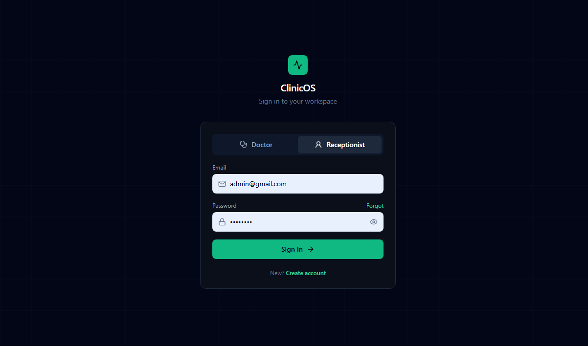 |
| **User Registration** | 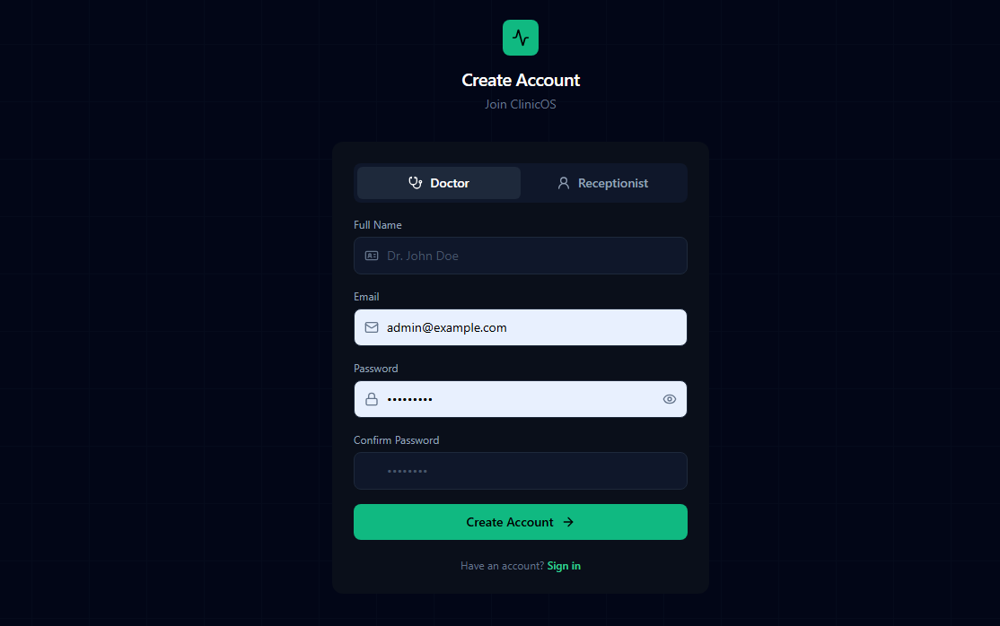 |
| **Doctor Dashboard** | 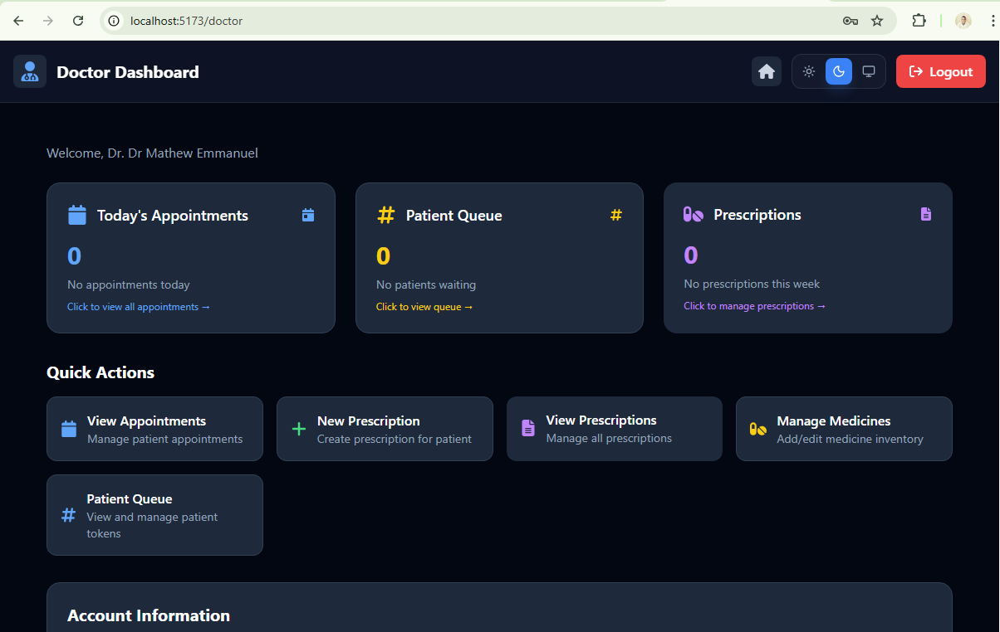 |
| **Doctor Appointments** | 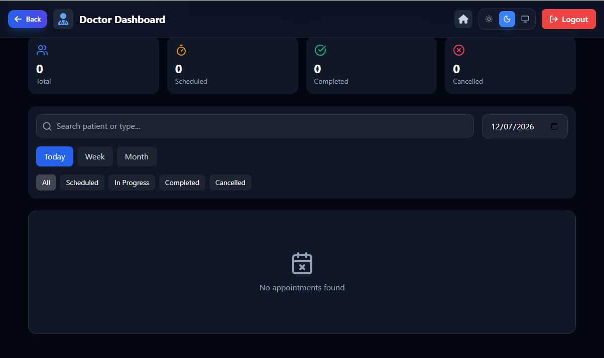 |
| **Doctor Patient Queue** | 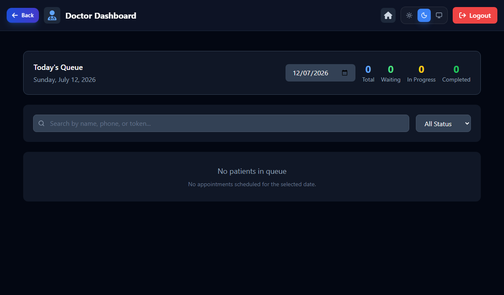 |
| **Doctor Prescriptions** | 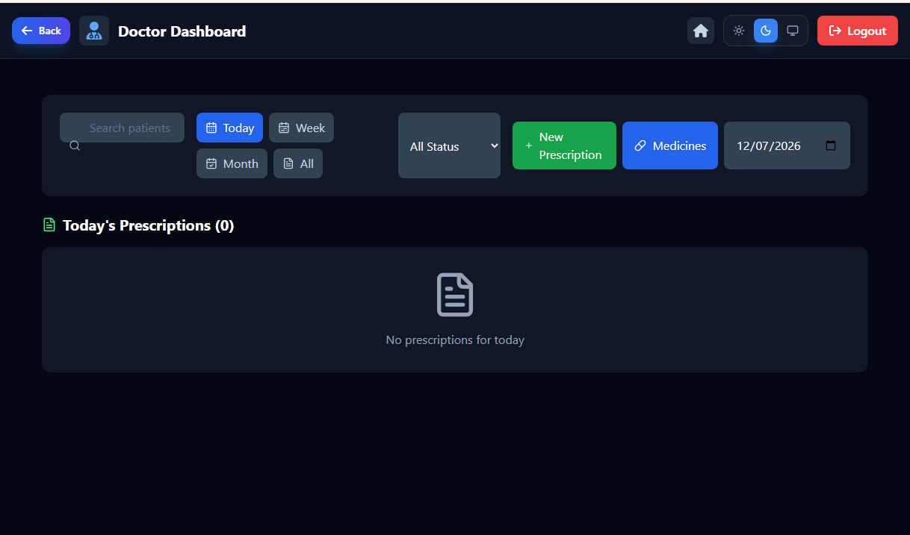 |
| **Doctor Medicine Management** | 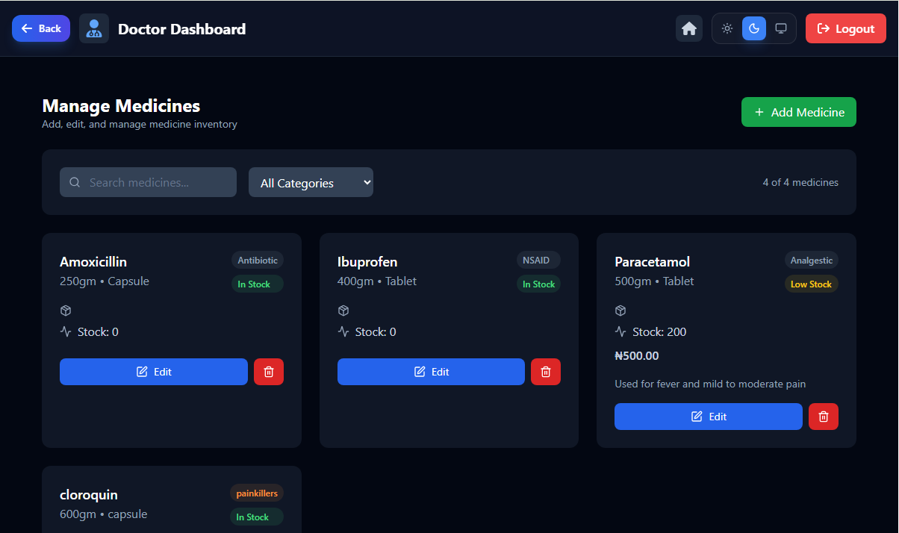 |
| **Receptionist Dashboard** | 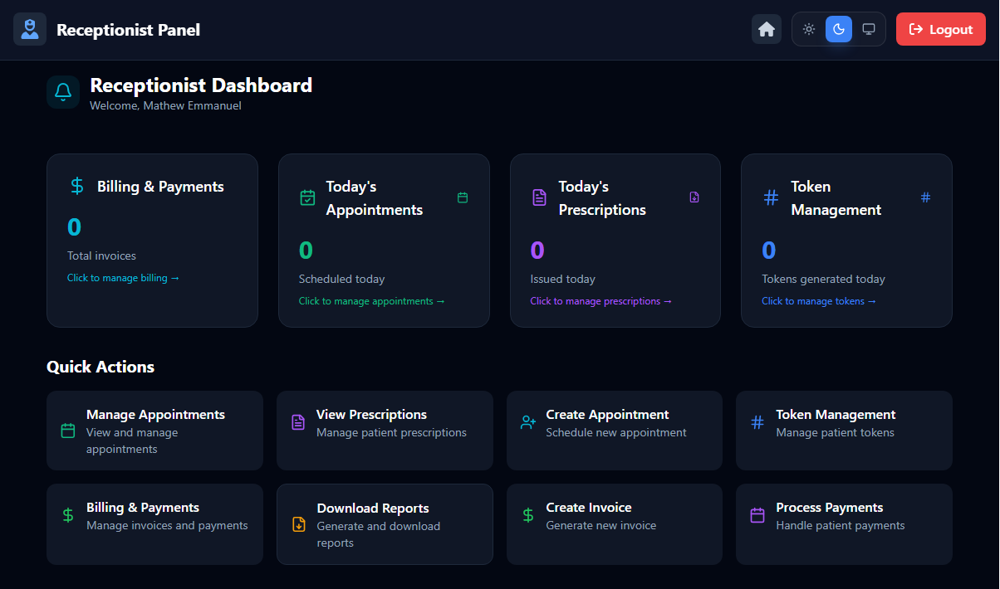 |
| **Receptionist Appointments** | 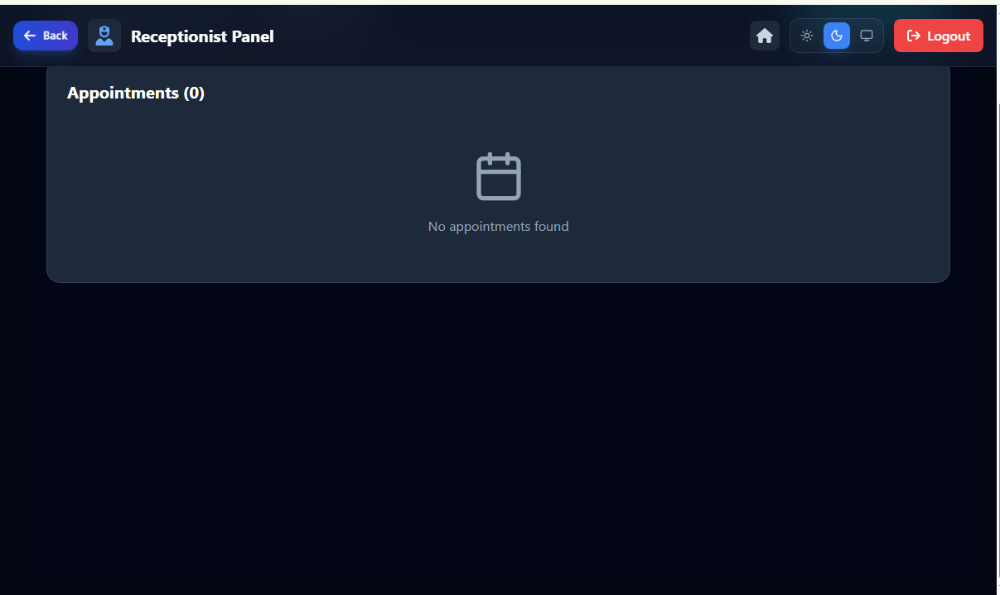 |
| **Receptionist Token Management** | 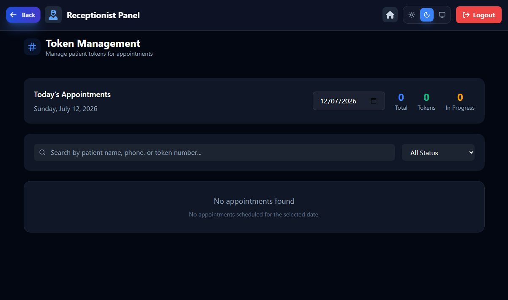 |
| **Receptionist Prescriptions** | 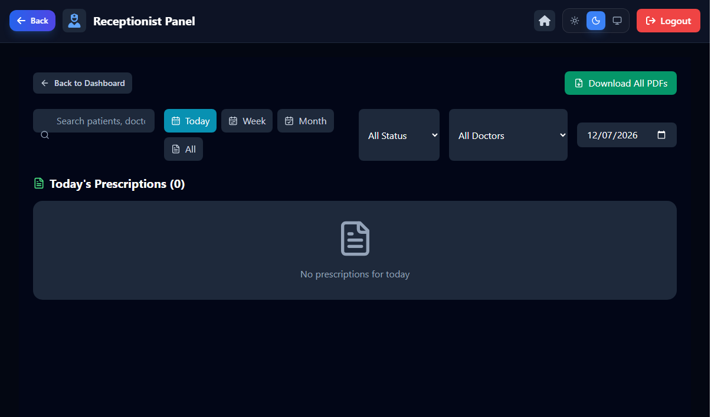 |
| **Receptionist Billing** | 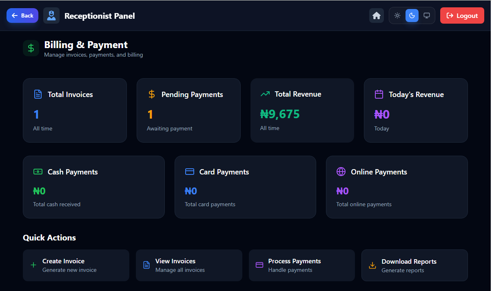 |
| **Receptionist Billing Reports** | 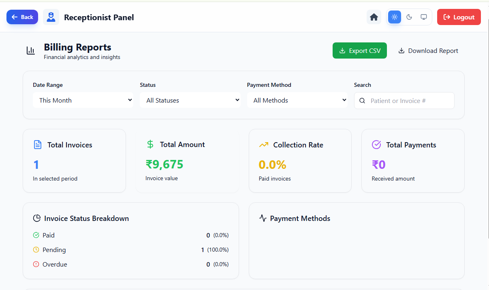 |

## 🚀 Quick Start

### Prerequisites
- Node.js (v16 or higher)
- npm or yarn
- Firebase project


### 1. Firebase Setup
1. Go to [Firebase Console](https://console.firebase.google.com/)
2. Create a new project or select existing one
3. Enable **Authentication** (Email/Password)
4. Enable **Firestore Database** (test mode)
5. Get your Firebase configuration

### 2. Environment Configuration
   ```bash
   cp env.example.txt .env
   ```

Update `.env` with your Firebase config:
   ```env
VITE_FIREBASE_API_KEY=your_api_key
   VITE_FIREBASE_AUTH_DOMAIN=your_project.firebaseapp.com
   VITE_FIREBASE_PROJECT_ID=your_project_id
   VITE_FIREBASE_STORAGE_BUCKET=your_project.appspot.com
   VITE_FIREBASE_MESSAGING_SENDER_ID=your_sender_id
   VITE_FIREBASE_APP_ID=your_app_id
   ```

### 3. Firebase Security Rules Configuration

**Important**: You must configure Firestore security rules to ensure proper data access control.

1. **Go to Firestore Database** in your Firebase Console
2. **Click on "Rules" tab**
3. **Replace the default rules** with the following:

```javascript
rules_version = '2';
service cloud.firestore {
  match /databases/{database}/documents {
    // Staff data access control
    match /staffData/{userId} {
      allow read, write: if request.auth != null && request.auth.uid == userId;
      allow create: if request.auth != null && request.auth.uid == userId;
    }
    
    // Appointments access control
    match /appointments/{document} {
      allow read: if request.auth != null;
      allow write: if request.auth != null && 
        (resource == null || resource.data.createdBy == request.auth.uid);
    }
    
    // Prescriptions access control
    match /prescriptions/{document} {
      allow read: if request.auth != null;
      allow write: if request.auth != null && 
        (resource == null || resource.data.doctorId == request.auth.uid);
    }
    
    // Medicines access control
    match /medicines/{document} {
      allow read: if request.auth != null;
      allow write: if request.auth != null;
    }
    
    // Invoices access control
    match /invoices/{document} {
      allow read: if request.auth != null;
      allow write: if request.auth != null && 
        (resource == null || resource.data.createdBy == request.auth.uid);
    }
  }
}
```

4. **Click "Publish"** to save the rules

**Why These Rules Matter:**
- **Security**: Prevents unauthorized access to sensitive data
- **Role-based Access**: Ensures users can only access their own data
- **Data Protection**: Protects patient information and medical records
- **Compliance**: Meets healthcare data security requirements

### 4. Run Development Server
```bash
npm run dev
```

Visit `http://localhost:5173` to see your application!

## 🏗️ Project Structure

```
src/
├── components/          # Reusable UI components
│   ├── LogoutButton.jsx
│   ├── ProtectedRoute.jsx
│   ├── EmailVerificationStatus.jsx
│   └── TokenDisplay.jsx
├── contexts/           # React context providers
│   └── AuthContext.jsx
├── firebase/           # Firebase configuration
│   └── config.js
├── hooks/              # Custom React hooks
│   └── useAuth.js
├── pages/              # Application pages
│   ├── auth/           # Authentication pages
│   │   ├── Login.jsx
│   │   ├── Signup.jsx
│   │   ├── ForgotPasswordForm.jsx
│   │   └── VerifyEmail.jsx
│   ├── doctor/         # Doctor-specific pages
│   │   ├── Doctor.jsx
│   │   ├── appointment/
│   │   ├── prescriptions/
│   │   └── token/
│   ├── receptionist/   # Receptionist-specific pages
│   │   ├── Receptionist.jsx
│   │   ├── appointment/
│   │   ├── billing/
│   │   ├── prescriptions/
│   │   └── token/
│   └── Home.jsx
├── utils/              # Utility functions
│   └── authUtils.js
├── App.jsx             # Main application component
└── main.jsx            # Application entry point
```

## 🔧 Available Scripts

| Command | Description |
|---------|-------------|
| `npm run dev` | Start development server |
| `npm run build` | Build for production |
| `npm run preview` | Preview production build |
| `npm run lint` | Run ESLint for code quality |


## 🔒 Security Features

- **Email verification** required for account activation
- **Role-based access control** with protected routes
- **Secure password reset** via email
- **Firestore security rules** for data protection
- **Authentication state management** with React Context
- **Protected API endpoints** and data access

## 📧 Email Verification System

The system uses Firebase's built-in email verification:

1. **Automatic Email**: Sent when users sign up
2. **Verification Status**: Real-time display on dashboard
3. **Manual Refresh**: Users can check verification status
4. **Reliable System**: Direct integration with Firebase Auth

## 🛠️ Tech Stack

### Frontend
- **React 19** - Modern React with latest features
- **Vite** - Fast build tool and development server
- **Tailwind CSS 4** - Utility-first CSS framework
- **React Router DOM** - Client-side routing
- **React Hot Toast** - Beautiful notifications
- **Lucide React** - Beautiful icons

### Backend & Database
- **Firebase Authentication** - User management
- **Firestore** - NoSQL cloud database
- **Firebase Security Rules** - Data access control

### Development Tools
- **ESLint** - Code quality and consistency
- **PostCSS** - CSS processing
- **Autoprefixer** - CSS vendor prefixing

## 📱 Responsive Design

- **Mobile-first** approach
- **Tablet** and **desktop** optimized
- **Touch-friendly** interface
- **Cross-browser** compatibility

## 🔄 Real-time Features

- **Live Updates** with Firebase listeners
- **Real-time Statistics** on dashboards
- **Instant Notifications** for actions
- **Live Patient Queue** management

## 📊 Data Management

- **Patient Records** with comprehensive information
- **Appointment Scheduling** with date/time management
- **Prescription Management** with medicine database
- **Billing System** with invoice generation
- **Token System** for patient queue management

## 🤝 Contributing

We welcome contributions! Please follow these steps:

1. **Fork** the repository
2. **Create** a feature branch (`git checkout -b feature/AmazingFeature`)
3. **Commit** your changes (`git commit -m 'Add some AmazingFeature'`)
4. **Push** to the branch (`git push origin feature/AmazingFeature`)
5. **Open** a Pull Request


## 👨‍💻 Author

**Dhruv Patel**
- GitHub: [@mattemmia](https://github.com/mattemmia)
- Number: [Mathew Emmanuel](07038321151)
<a 
  href="https://wa.me/2349036583105?text=Hi, I'm interested in your Clinic Management System" 
  target="_blank" 
  rel="noopener noreferrer"
  className="flex items-center gap-2 px-4 py-2 bg-green-500 hover:bg-green-600 text-white rounded-lg"
>
  Chat on WhatsApp
</a>

## 🙏 Acknowledgments

- **Firebase** for backend services
- **Vercel** for hosting and deployment
- **React Team** for the amazing framework
- **Tailwind CSS** for the beautiful styling system
- **Open Source Community** for inspiration and tools

